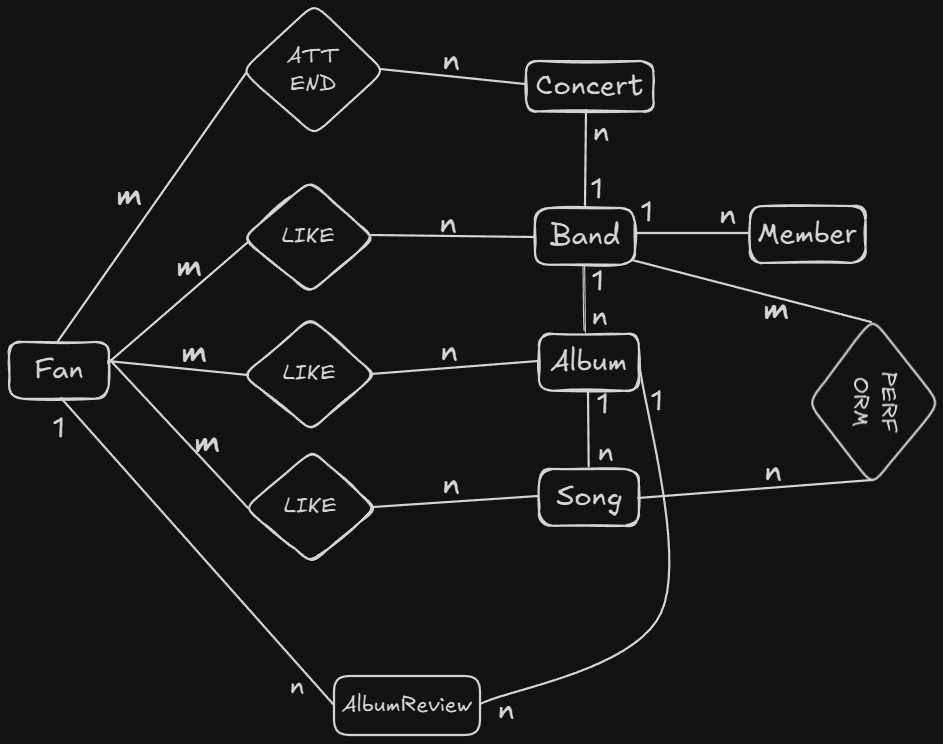
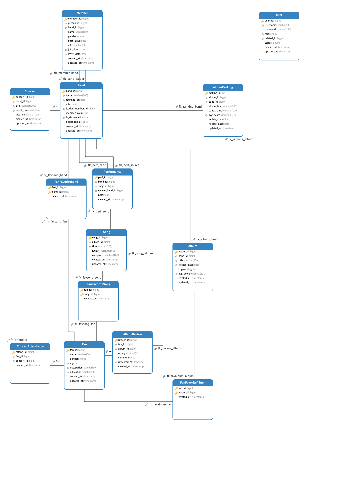

# 乐队数据库管理系统需求&设计文档

[TOC]

## 数据库

### 数据库应用场景

* 建立一个乐队相关数据库，记录乐队、乐队成员、专辑、歌曲、演唱会、乐评和歌迷等的信息：
* 每个乐队包括名称、成员、成立时间、乐队介绍等，每个乐队有一个队长；
* 乐队每位成员包括姓名、性别、年龄、乐队分工等，每个成员有加入乐队的时间，（如果中途离开）有离开乐队的时间；
* 专辑包括名称、发表时间、专辑文案等，每个乐队可发表多张专辑；
* 歌曲包括歌曲名称、词曲作者、所在专辑等；
* 演唱会包括演唱会名称、举办时间、地点等；
* 歌迷包括姓名、性别、年龄、职业、学历等。

* 规定
  * 每个乐队只有一名队长，每个乐队成员同一时期只能加入一个乐队；
  * 一个乐队可以演唱多首歌曲（包括别的乐队歌曲），同一首歌可以被多个乐队演唱；
  * 一个乐队可以举办多场演唱会，且假设同一场演唱会没有多个乐队参加；
  * 歌迷可以喜欢多个乐队、专辑及歌曲，歌迷可以给专辑评论、打分（同一张专辑只能打一次），歌迷可以参加任意演唱会；
  * 每张专辑有自己的乐评信息，包括所有歌迷的评论，以及计算平均分得出专辑的乐评分数。

### 数据库系统设计

#### 1、需求分析

分析该场景中的数据项、数据结构、数据流，可能有完整性和安全性要求，形成需求分析报告。

  - 核心实体及数据项：
    - Band：名称、成立日期、简介、队长（唯一成员外键）、成员人数（后续触发器维护）。
    - Member：姓名、性别、出生日期/年龄、分工、加入日期、离开日期（必填，可约束离开日期≥加入日期）。
    - Album：名称、发行日期、文案、所属乐队、乐评分（平均分缓存）。
    - Song：名称、词作者、曲作者、所属专辑，可被多乐队演唱。
    - Concert：名称、举办时间、地点、承办乐队。
    - Fan：姓名、性别、年龄、职业、学历。
    - AlbumReview：评论内容、评分(1–10 步长 0.5)、评论时间、评论人、目标专辑。
  - 数据流/业务操作：
    - 乐队用户维护乐队、成员、专辑、歌曲、演唱会信息，可查粉丝与乐评。
    - 粉丝用户维护个人资料及喜欢列表（乐队、专辑、歌曲三种）、参加演唱会记录、提交专辑乐评。
    - Admin 拥有所有读写权限，用于全局维护与审计。
    - 乐评流程：粉丝提交评分与评论 → 写入 AlbumReview → 更新专辑平均分；同一粉丝不能重复评分同一专辑。
  - 完整性/安全性要求：
    - 外键约束确保引用完整性（乐队-成员、乐队-专辑等）；加入/离开日期必须存在且满足时间顺序。
    - 评分范围约束（1–10，步长 0.5），文本字段长度控制，必要唯一约束（乐队名、专辑名+乐队等）。
    - 需要触发器保持乐队成员数、专辑排行榜同步，并跟踪成员历史，确保每个乐队成员同一时期只能加入一个乐队。
    - 日期完整性约束：成员加入日期、专辑发行日期、演唱会日期均不能早于乐队成立日期，通过触发器和应用层双重验证。
    - 角色隔离：admin、band、fan；band 用户只能操作本乐队与其相关信息；fan 用户仅能操作自身与乐评。
    - 视图与统计：band 用户查看自己粉丝及乐评、基础统计（数量/年龄段/性别/职业/学历、最受欢迎歌曲等）。

#### 2、概念模型设计

用E-R图实现以上需求分析报告的内容。

* 实体与主键

  * Band(band_id, name, founded_at, intro, leader_member_id, member_count, is_disbanded, disbanded_at)；leader_member_id 自反指向成员关系，is_disbanded 标识乐队是否已解散，disbanded_at 记录解散日期。

  - Member(member_id, name, gender, birth_date/age, role, join_date, leave_date, band_id)；join_date、leave_date 均必填。

- Album(album_id, title, release_date, copywriting, band_id, avg_score)。
  - Song(song_id, title, lyricist, composer, album_id)。
- Concert(concert_id, title, event_time, location, band_id)。
  - Fan(fan_id, name, gender, age, occupation, education)。
- AlbumReview(review_id, fan_id, album_id, rating, comment, reviewed_at)。

- 关系与基数
  - Band 1——N Member（含“Leader”子类型：Band 指向自身成员，约束唯一）。
  - Band 1——N Album；Album 1——N Song。
  - Band M——N Song（通过 Performance），同一首歌可被多乐队演唱。
  - Band 1——N Concert；Fan M——N Concert（ConcertAttendance）。
  - Fan M——N Band (FanFavoriteBand)、Fan M——N Album (FanFavoriteAlbum)、Fan M——N Song (FanFavoriteSong)。
  - Fan 1——N AlbumReview（必须在 AlbumReview 上显式设定唯一约束 UNIQUE(fan_id, album_id)，这样数据库会拒绝同一 (fan_id, album_id) 再插入第二行，从而保证“每位粉丝对某张专辑只评论一次”）
  - Album 1——N AlbumReview，avg_score 由触发器/程序维护。



#### 3、逻辑模型设计

根据E-R图建立关系模型，转化为相应的关系模式；定义关系模型所有的完整性约束；应用数据库规范化理论优化关系模型。

* 核心实体表
  - User(user_id BIGINT PK, username VARCHAR(50) NOT NULL UNIQUE, password VARCHAR(255) NOT NULL, role ENUM('ADMIN','BAND','FAN') NOT NULL, related_id BIGINT NULL, status TINYINT NOT NULL DEFAULT 1, created_at/updated_at TIMESTAMP)，在 username、role、related_id 上单独建索引，related_id 分别指向 Band 或 Fan（管理员为空）。
  - Band(band_id BIGINT PK, name VARCHAR(100) NOT NULL UNIQUE, founded_at DATE NOT NULL, intro TEXT, leader_member_id BIGINT FK→Member.member_id, member_count INT NOT NULL DEFAULT 0, is_disbanded CHAR(1) NOT NULL DEFAULT 'N', disbanded_at DATE NULL, created_at/updated_at TIMESTAMP，idx_founded_at)；leader 通过外键 RESTRICT 约束，member_count 由触发器仅统计 leave_date IS NULL 的在队成员，is_disbanded 标识乐队是否已解散（'Y'/'N'），disbanded_at 记录解散日期。
  - Member(member_id BIGINT PK, person_id BIGINT, band_id BIGINT NOT NULL, name VARCHAR(50) NOT NULL, gender ENUM('M','F','O') NOT NULL, birth_date DATE NOT NULL, role VARCHAR(50) NOT NULL, join_date DATE NOT NULL, leave_date DATE NULL, created_at/updated_at TIMESTAMP, FK→Band(band_id))；CHECK(leave_date IS NULL OR leave_date >= join_date)，person_id 追踪同一自然人跨阶段任职。
  - Album(album_id BIGINT PK, band_id BIGINT NOT NULL, title VARCHAR(200) NOT NULL, release_date DATE NOT NULL, copywriting TEXT, avg_score DECIMAL(3,1) NULL, created_at/updated_at TIMESTAMP, UNIQUE(band_id, title) 以及 idx_band_id/idx_release_date/idx_avg_score)。
  - Song(song_id BIGINT PK, album_id BIGINT NOT NULL, title VARCHAR(200) NOT NULL, lyricist/composer VARCHAR(100), created_at/updated_at TIMESTAMP, UNIQUE(album_id, title) 与 idx_album_id)。
  - Concert(concert_id BIGINT PK, band_id BIGINT NOT NULL, title VARCHAR(200) NOT NULL, event_time DATETIME NOT NULL, location VARCHAR(200) NOT NULL, created_at/updated_at TIMESTAMP, UNIQUE(band_id, title, event_time) 并在 band_id、event_time 上建索引)。
  - Fan(fan_id BIGINT PK, name VARCHAR(50) NOT NULL, gender ENUM('M','F','O') NOT NULL, age INT NOT NULL CHECK(age BETWEEN 0 AND 120), occupation/education VARCHAR(50), created_at/updated_at TIMESTAMP，idx_age/idx_occupation/idx_education)。
* 业务关系 / 日志表
  - Performance(perf_id BIGINT PK, band_id BIGINT NOT NULL, song_id BIGINT NOT NULL, source_band_id BIGINT NULL, note TEXT, created_at TIMESTAMP, UNIQUE(band_id, song_id))；band_id、song_id、source_band_id 均有索引，source_band_id 支持标识原唱乐队。
  - ConcertAttendance(attend_id BIGINT PK, fan_id BIGINT NOT NULL, concert_id BIGINT NOT NULL, created_at TIMESTAMP DEFAULT CURRENT_TIMESTAMP, UNIQUE(fan_id, concert_id))，fan_id、concert_id 均索引，记录歌迷参演日志。
  - FanFavoriteBand(fan_id BIGINT, band_id BIGINT, created_at TIMESTAMP, PK(fan_id, band_id) + idx_band_id)。
  - FanFavoriteAlbum(fan_id BIGINT, album_id BIGINT, created_at TIMESTAMP, PK(fan_id, album_id) + idx_album_id)。
  - FanFavoriteSong(fan_id BIGINT, song_id BIGINT, created_at TIMESTAMP, PK(fan_id, song_id) + idx_song_id)。
  - AlbumReview(review_id BIGINT PK, fan_id BIGINT NOT NULL, album_id BIGINT NOT NULL, rating DECIMAL(3,1) NOT NULL, comment TEXT, reviewed_at DATETIME NOT NULL, created_at TIMESTAMP, UNIQUE(fan_id, album_id))；CHECK(rating BETWEEN 1 AND 10) 与 CHECK(rating * 2 = FLOOR(rating * 2)) 联合保证 0.5 分级，fan_id/album_id/reviewed_at 均建索引。
* 衍生统计表
  - AlbumRanking(ranking_id INT PK, album_id BIGINT NOT NULL UNIQUE, band_id BIGINT NOT NULL, album_title VARCHAR(200), band_name VARCHAR(100), avg_score DECIMAL(3,1) NOT NULL, review_count INT NOT NULL DEFAULT 0, release_date DATE NOT NULL, updated_at TIMESTAMP, idx_avg_score DESC)，由存储过程 `sp_update_album_ranking` 与 AlbumReview 三个触发器维护榜单。
* 完整性约束
  - 实体完整性：各表主键（含 User、Band、Member、Album、Song、Concert、Fan 等）均 NOT NULL 且自增，Band.name、User.username 等关键字段设置 UNIQUE。
  - 引用完整性：外键实现与 SQL 一致——Band.leader_member_id、Member.band_id 使用 ON UPDATE/DELETE RESTRICT；Album/Song/Concert 与父表采用 ON DELETE CASCADE；FanFavorite*/Performance/AlbumReview/ConcertAttendance/User 等表均通过 FK 指向父实体。
  - 用户定义完整性：
    - CHECK 约束：`Fan.age BETWEEN 0 AND 120`、`leave_date IS NULL OR leave_date >= join_date`、`rating BETWEEN 1 AND 10`、`rating * 2 = FLOOR(rating * 2)` 等；性别统一限定在 ENUM('M','F','O')。
    - UNIQUE / 组合主键：Band.name、Album(band_id,title)、Song(album_id,title)、Concert(band_id,title,event_time)、AlbumReview(fan_id,album_id)、ConcertAttendance(fan_id,concert_id) 以及各 FanFavorite 表的联合主键，防止重复喜好/参演/评论。
    - 乐队解散约束：
      - 解散乐队时，自动将所有未离队成员（leave_date IS NULL）设置为已离队，离队日期设置为解散日期
      - 已解散的乐队不能重复解散
      - 管理员编辑已解散乐队的解散日期时，系统自动更新离队日期与旧解散日期一致的成员
      - 为已解散乐队添加成员时（Admin Privilege Mode），离队日期必填且不能晚于乐队解散日期
      - 此约束在应用层实施，用于历史数据修正
  - 触发器与过程：
    - `trg_member_insert/update/delete` 自动维护 Band.member_count，仅统计仍在队成员。
    - `trg_band_check_leader` 校验 leader 属于本队。
    - `trg_member_check_person_overlap_*` 利用 person_id 和时间范围防止同一自然人在同一时间段加入多个乐队。
    - `trg_member_check_join_date_*` 确保成员加入日期不早于乐队成立日期。
    - `trg_album_check_release_date_*` 确保专辑发行日期不早于乐队成立日期。
    - `trg_concert_check_event_time_*` 确保演唱会日期不早于乐队成立日期。
    - `trg_review_*` + `sp_update_album_ranking` 同步 Album.avg_score 和 AlbumRanking。
  - 日期完整性约束：
    - 成员加入日期（join_date）必须 >= 乐队成立日期（founded_at）
    - 专辑发行日期（release_date）必须 >= 乐队成立日期（founded_at）
    - 演唱会日期（event_time）必须 >= 乐队成立日期（founded_at）
    - 通过数据库触发器和应用层双重验证确保时间顺序的逻辑正确性
* 规范化讨论
  - 所有关系达到 3NF/BCNF，member_count 与 avg_score 属于性能字段，通过触发器保持派生值一致性，与 SQL 文件保持一致。
* 索引设计（逻辑层）
  - 唯一索引：Band.name、Album(band_id,title)、Song(album_id,title)、Concert(band_id,title,event_time)、AlbumReview(fan_id,album_id)、ConcertAttendance(fan_id,concert_id)、FanFavoriteBand/FanFavoriteAlbum/FanFavoriteSong 的主键以及 AlbumRanking.album_id。
  - 普通索引：Band.idx_founded_at、Member.idx_band_id/idx_join_leave/idx_person_dates、Album.idx_band_id/idx_release_date/idx_avg_score、Song.idx_album_id、Concert.idx_band_id/idx_event_time、Fan.idx_age/idx_occupation/idx_education、Performance.idx_band_id/idx_song_id、ConcertAttendance.idx_fan_id/idx_concert_id、FanFavoriteBand.idx_band_id、FanFavoriteAlbum.idx_album_id、FanFavoriteSong.idx_song_id、AlbumReview.idx_fan_id/idx_album_id/idx_reviewed_at、AlbumRanking.idx_avg_score、User.idx_username/idx_role/idx_related_id 等索引用于支撑高频检索。

#### 4、数据库实施

`database_implementation.sql`

`user_table_creation.sql`

##### 建库建表

创建了完整的 `band_management` 数据库，包含14张表：

**核心实体表（6张）**

- `Band` - 乐队表（含队长外键、成员人数字段）
- `Member` - 成员表（含加入/离开时间约束）
- `Album` - 专辑表（含平均评分字段）
- `Song` - 歌曲表（含词曲作者）
- `Concert` - 演唱会表（含时间地点）
- `Fan` - 歌迷表（含职业学历）

**关系表（6张）**

- `Performance` - 乐队演唱歌曲关系（支持翻唱）
- `AlbumReview` - 专辑乐评（含评分和评论）
- `ConcertAttendance` - 演唱会参与记录
- `FanFavoriteBand` - 歌迷喜欢的乐队
- `FanFavoriteAlbum` - 歌迷喜欢的专辑
- `FanFavoriteSong` - 歌迷喜欢的歌曲

**辅助表（1张）**

- `AlbumRanking` - 专辑排行榜（在完整性实施中创建）

**用户表（1张）**

* `User`

##### 数据初始化

录入一批数据，数据量尽量保证能够支撑后续应用系统页面的展示。

| 数据类型   | 数量   | 说明                                 |
| ---------- | ------ | ------------------------------------ |
| 乐队       | 10个   | 包含中国和国际知名乐队               |
| 成员       | 39人   | 涵盖主唱、吉他手、贝斯手、鼓手等角色 |
| 专辑       | 24张   | 各乐队的代表性专辑                   |
| 歌曲       | 75首   | 包含各专辑的经典曲目                 |
| 演唱会     | 14场   | 覆盖北京、上海、广州、成都等城市     |
| 歌迷       | 25人   | 包含不同年龄、职业、学历背景         |
| 乐评       | 32条   | 评分从7.0到10.0，包含详细评论        |
| 喜好记录   | 100+条 | 歌迷对乐队、专辑、歌曲的喜好         |
| 演唱会参与 | 30条   | 歌迷参加演唱会的记录                 |
| 演唱关系   | 78条   | 包括原创和翻唱关系                   |

#### 6、数据库完整性要求 

* 在乐队表中添加一个属性：成员人数，然后建立一个触发器，要求如下：当该乐队添加或删除成员时，成员人数随之改变；进行乐队成员增加或删除操作，验证触发器有效性
* 创建一张专辑排行表，收录乐评分数前十的专辑，并且创建触发器如下：当专辑分数更新时，及时更新此排行表。进行乐迷打分操作，验证触发器有效性。
* **日期完整性约束**：确保成员加入日期、专辑发行日期、演唱会日期不早于乐队成立日期，通过触发器在数据库层面强制执行，并在应用层提供友好的错误提示。

`database_integrity.sql`

触发器功能说明：

1. 成员人数自动维护
   - 添加成员时：自动更新乐队的member_count（只统计在队成员）
   - 删除成员时：自动更新乐队的member_count
   - 更新成员时：如果改变乐队或离队状态，自动更新相关乐队的member_count

2. 专辑排行榜自动更新
   - 添加乐评时：自动更新专辑平均分和排行榜
   - 修改乐评时：自动更新专辑平均分和排行榜
   - 删除乐评时：自动更新专辑平均分和排行榜

3. 队长约束
   - 设置队长时：自动检查队长是否是本乐队成员
   - 如果不是，抛出错误：队长必须是该乐队的成员

4. 成员时间重叠约束
   - 添加成员时：检查同一人是否在同一时间段加入多个乐队
   - 更新成员时：检查修改后是否导致时间重叠
   - 如果重叠，抛出错误：A person cannot join multiple bands at the same time

5. **日期完整性约束**（新增）
   - **成员加入日期约束**：
     - 插入成员时：检查加入日期是否早于乐队成立日期
     - 更新成员时：检查加入日期是否早于乐队成立日期
     - 如果违反，抛出错误：成员加入日期不能早于乐队成立日期
   - **专辑发行日期约束**：
     - 插入专辑时：检查发行日期是否早于乐队成立日期
     - 更新专辑时：检查发行日期是否早于乐队成立日期
     - 如果违反，抛出错误：专辑发行日期不能早于乐队成立日期
   - **演唱会日期约束**：
     - 插入演唱会时：检查演出时间是否早于乐队成立日期
     - 更新演唱会时：检查演出时间是否早于乐队成立日期
     - 如果违反，抛出错误：演唱会日期不能早于乐队成立日期

#### 7、数据库安全性实施

`database_security.sql`

##### 创建用户

1、管理员用户 (admin_user)

* 密码：Admin@123456
* 权限范围：
  * ✅ 拥有数据库的所有权限 (ALL PRIVILEGES)
  * ✅ 可以创建、修改、删除任何表和数据
  * ✅ 可以管理用户和权限 (WITH GRANT OPTION)
  * ✅ 可以授予其他用户权限
  * ✅ 完全控制整个 band_management 数据库

* 适用场景：系统管理、数据库维护、用户管理

2、乐队用户 (band_user)

* 密码：Band@123456

* 可以维护（SELECT, INSERT, UPDATE, DELETE）：
  * ✅ Band - 乐队信息
  * ✅ Member - 成员信息
  * ✅ Album - 专辑信息
  * ✅ Song - 歌曲信息
  * ✅ Concert - 演唱会信息
  * ✅ Performance - 演唱关系（原创/翻唱）

* 只能查看（SELECT）：
  * 👁️ Fan - 歌迷信息
  * 👁️ AlbumReview - 乐评信息
  * 👁️ ConcertAttendance - 演唱会参加记录
  * 👁️ FanFavoriteBand - 歌迷喜欢的乐队
  * 👁️ FanFavoriteAlbum - 歌迷喜欢的专辑
  * 👁️ FanFavoriteSong - 歌迷喜欢的歌曲
  * 👁️ User - 用户表（用于登录验证）

* 可以通过视图查看本乐队的统计信息：
  * 📊 v_band_fans - 该乐队的歌迷列表
  * 📊 v_band_reviews - 该乐队的乐评列表
  * 📊 v_band_fan_count - 歌迷总数统计
  * 📊 v_band_fan_age_stats - 歌迷年龄段分布
  * 📊 v_band_fan_gender_stats - 歌迷性别分布
  * 📊 v_band_fan_occupation_stats - 歌迷职业分布
  * 📊 v_band_fan_education_stats - 歌迷学历分布
  * 📊 v_band_popular_songs - 最受欢迎的歌曲（前10）
  * 📊 v_band_popular_concerts - 演唱会参与情况
  * 📊 v_band_album_ratings - 专辑评分统计

* 权限限制：
  * ❌ 不能修改歌迷数据（Fan表只读）
  * ❌ 不能修改或删除乐评数据（AlbumReview表只读）
  * ❌ 不能修改歌迷喜好数据（FanFavorite*表只读）
  * ❌ 不能修改演唱会参加记录（ConcertAttendance表只读）

* 适用场景：乐队管理自己的信息、查看歌迷反馈和统计数据

3、歌迷用户 (fan_user)

* 密码：Fan@123456
* 可以维护（SELECT, INSERT, UPDATE, DELETE）：
  * ✅ Fan - 歌迷个人信息
  * ✅ FanFavoriteBand - 喜欢的乐队
  * ✅ FanFavoriteAlbum - 喜欢的专辑
  * ✅ FanFavoriteSong - 喜欢的歌曲
  * ✅ ConcertAttendance - 演唱会参加记录
  * ✅ AlbumReview - 专辑乐评（发表、修改、删除）

* 只能查看（SELECT）：
  * 👁️ Band - 乐队信息
  * 👁️ Member - 成员信息
  * 👁️ Album - 专辑信息
  * 👁️ Song - 歌曲信息
  * 👁️ Concert - 演唱会信息
  * 👁️ Performance - 演唱关系
  * 👁️ AlbumRanking - 专辑排行榜
  * 👁️ User - 用户表（用于登录验证）

* 权限限制：
  * ❌ 不能修改乐队相关的任何数据（Band、Member、Album、Song、Concert、Performance表只读）
  * ❌ 不能查看或修改其他歌迷的个人信息（应用层需要额外控制）

* 适用场景：歌迷浏览乐队信息、管理个人喜好、发表乐评、记录演唱会参与

##### 视图机制(实际项目没有用到)

利用视图机制，使某个乐队用户Band1只能查看自己的歌迷信息、乐评信息，并利用视图实现简单的歌迷人数统计、年龄、性别、职业、学历范围统计，最喜欢的歌曲、演唱会统计等。

视图（10个）

- 歌迷列表、乐评列表
- 歌迷统计（总数、年龄、性别、职业、学历）
- 内容排行（歌曲、演唱会、专辑评分）

##### 验证用户权限

分别使用以上不同用户登录数据库，进行相应的操作，验证以上措施的有效性。

`user_verification_tests.sql`

#### 数据库创建结果



## 基于数据库的web应用

### 功能基本要求

基于已完成的MySQL数据库设计（包含数据库实施、安全性配置和完整性约束），开发一个完整的乐队管理系统Java Web应用。

* 实现用户登录功能，可选择为管理员用户、乐队用户或歌迷用户。 
* 管理员用户可以对任何后台数据进行所有权限操作； 
* 使用乐队用户登录，要求实现以下功能：
  * 显示、发布、修改、删除本乐队相关信息，包括乐队信息、成员
    信息、专辑信息、歌曲信息、演唱会信息； 
  * 查看歌迷相关信息，包括乐队歌迷信息、喜欢本乐队专辑、歌曲
    的歌迷信息，参加本乐队演唱会的歌迷信息等； 
  * 查看乐队发布专辑的乐评情况，包括分数、评论。 
* 使用乐迷用户登录，要求实现以下功能： 
  * 该乐迷用户身份信息维护； 
  * 显示该乐迷所喜欢的乐队、专辑、歌曲，参加的演唱会信息等，
    可以点开每一行查看详细信息； 
  * 该乐迷可以添加、删除、修改喜欢的乐队、专辑、歌曲，参加的
    演唱会等； 
  * 该乐迷可以查看所有未关注的乐队、专辑、歌曲、演唱会信息（可增加查询功能），可查看专辑排名； 
  * 该乐迷可以给任何专辑评论、评分。 
* 可自行添加相应功能

### 应用系统设计

#### 1. 技术栈

##### 1.1 后端技术栈

| 技术 | 版本 | 用途 |
|------|------|------|
| Spring Boot | 2.7.18 | 应用框架，提供自动配置和依赖管理 |
| MyBatis | 2.3.1 | ORM 框架，数据持久化 |
| MySQL | 8.0+ | 关系型数据库 |
| Druid | 1.2.20 | 数据库连接池，提供监控和扩展功能 |
| PageHelper | 1.4.7 | MyBatis 分页插件 |
| Pinyin4j | 2.5.1 | 中文转拼音工具库 |
| Maven | 3.6+ | 项目构建和依赖管理 |

##### 1.2 前端技术栈

| 技术 | 版本 | 用途 |
|------|------|------|
| Vue.js | 3.x | 前端框架 |
| Vue Router | 4.x | 路由管理 |
| Pinia | 2.x | 状态管理 |
| Element Plus | 2.x | UI 组件库 |
| Axios | 1.x | HTTP 请求库 |
| Vite | 4.x | 前端构建工具 |

##### 1.3 数据库特性

| 特性 | 说明 |
|------|------|
| 触发器 | 自动维护数据一致性（成员人数、专辑评分、排行榜） |
| 存储过程 | 复杂业务逻辑封装（排行榜更新） |
| 外键约束 | 引用完整性保证 |
| CHECK 约束 | 数据范围验证（评分、日期逻辑） |
| UNIQUE 约束 | 唯一性保证（防止重复评论） |
| 视图 | 数据查询简化（歌迷统计、乐队数据） |

#### 2. 核心架构设计

##### 2.1 多数据源动态切换架构

**设计目标**: 实现基于角色的数据库权限隔离，不同角色使用不同的数据库用户连接

**核心组件**:

1. **DataSourceContextHolder** - 数据源上下文持有者
   - 使用 ThreadLocal 存储当前线程的数据源类型
   - 提供 setDataSourceType()、getDataSourceType()、clearDataSourceType() 方法
   - 确保线程安全，防止数据源混乱

2. **DynamicDataSource** - 动态数据源
   - 继承 Spring 的 AbstractRoutingDataSource
   - 重写 determineCurrentLookupKey() 方法
   - 根据 ThreadLocal 中的值动态返回数据源 key

3. **DataSourceConfig** - 数据源配置类
   - 创建三个独立的 Druid 数据源（admin、band、fan）
   - 配置动态数据源，注册所有数据源到 targetDataSources
   - 设置默认数据源为 admin

**工作流程**:
```
用户请求 → Service层设置数据源类型 → ThreadLocal存储 
→ MyBatis执行SQL → DynamicDataSource获取数据源key 
→ 使用对应数据源执行 → 请求结束清理ThreadLocal
```

**权限隔离表**:

| 数据源 | 数据库用户 | 密码 | 权限范围 |
|--------|-----------|------|---------|
| admin | admin_user | Admin@123456 | 所有表的增删改查权限 |
| band | band_user | Band@123456 | 管理本乐队数据，查看歌迷数据 |
| fan | fan_user | Fan@123456 | 管理个人数据，查看乐队数据 |

##### 2.2 认证与授权机制

###### 2.2.1 Session + Cookie 认证

**实现方式**:
- 用户登录成功后，服务器创建 HttpSession 并返回 JSESSIONID Cookie
- 后续请求携带 Cookie，服务器从 Session 中获取用户信息
- Session 默认超时时间 30 分钟
- 前端使用 Axios 配置 withCredentials: true 携带 Cookie

**登录流程**:
1. 前端提交用户名、密码、角色（ADMIN/BAND/FAN）
2. AuthService 根据角色切换数据源（DataSourceContextHolder.setDataSourceType）
3. 查询 User 表验证用户名和密码（支持加密和明文）
4. 验证通过后将用户信息（userId、username、role、entityId）存入 Session
5. 返回用户基本信息给前端
6. 前端根据角色跳转到对应主页

**登出流程**:
1. 前端调用登出接口
2. 服务器清除 Session
3. 前端清除本地存储的用户信息
4. 跳转到登录页

###### 2.2.2 用户注册与自动生成用户名

**乐队注册**:
- 输入：乐队名称、成立日期、乐队简介、密码
- 使用 PinyinUtil（基于 pinyin4j）将乐队名称转为拼音
- 生成用户名：`band_` + 拼音（如：band_taopaojihua）
- 检查用户名是否已存在，存在则添加数字后缀
- 切换到 ADMIN 数据源（只有 admin 有 INSERT 权限）
- 创建 Band 记录和 User 记录（事务保证一致性）
- 返回生成的用户名供登录使用

**歌迷注册**:
- 输入：姓名、性别、年龄、职业、学历、密码
- 使用 PinyinUtil 将姓名转为拼音
- 生成用户名：`fan_` + 拼音（如：fan_zhangsan）
- 检查用户名是否已存在，存在则添加数字后缀
- 切换到 ADMIN 数据源
- 创建 Fan 记录和 User 记录（事务保证一致性）
- 返回生成的用户名供登录使用

**优势**:
- 用户无需手动输入用户名，降低注册门槛
- 用户名规范统一，便于管理
- 自动处理重名情况

###### 2.2.3 权限控制

**数据库层权限隔离**:
- 通过 MySQL 用户权限系统实现（database_security.sql）
- admin_user：所有表的 SELECT、INSERT、UPDATE、DELETE 权限
- band_user：部分表的 SELECT 权限，本乐队数据的 UPDATE、DELETE 权限
- fan_user：部分表的 SELECT 权限，个人数据的 UPDATE、DELETE 权限

**应用层权限控制**:
- Session 验证：检查用户是否登录
- 角色验证：检查用户角色是否有权访问该接口
- 数据归属验证：检查用户是否有权操作该数据（如乐队只能管理自己的成员）

**前端路由守卫**:
- 使用 Vue Router 的 beforeEach 钩子
- 检查用户登录状态（从 Pinia store 获取）
- 未登录自动跳转登录页
- 根据角色动态加载路由

##### 2.3 业务层设计

###### 2.3.1 分页查询实现

**使用 PageHelper 插件**:
```java
// 在查询前调用
PageHelper.startPage(pageNum, pageSize);
// 执行查询
List<Entity> list = mapper.selectAll();
// 封装分页结果
PageInfo<Entity> pageInfo = new PageInfo<>(list);
// 转换为统一响应格式
return PageResult.of(pageInfo);
```

**优势**:
- PageHelper 自动拦截 SQL，添加 LIMIT 和 OFFSET 子句
- 无需手动编写分页 SQL
- 自动计算总页数、总记录数

###### 2.3.2 数据源切换策略

**在 Service 层实现**:
```java
// 设置数据源
DataSourceContextHolder.setDataSourceType("admin");
// 执行数据库操作
List<Song> list = songMapper.selectAll();
// 请求结束时自动清理（通过拦截器或过滤器）
```

**切换时机**:
- 登录/注册：根据用户角色切换
- 查询操作：使用当前用户对应的数据源
- 写操作：根据业务需求切换（如注册需要 admin 权限）

###### 2.3.3 统一响应封装

**Result<T> 类**:
```java
{
  "code": 200,        // 状态码
  "message": "成功",  // 提示信息
  "data": {}          // 业务数据
}
```

**PageResult<T> 类**:
```java
{
  "total": 100,       // 总记录数
  "list": [],         // 数据列表
  "pageNum": 1,       // 当前页码
  "pageSize": 10,     // 每页大小
  "pages": 10         // 总页数
}
```

##### 2.4 数据访问层设计

###### 2.4.1 MyBatis 配置

**Mapper 接口**:
- 使用 @Mapper 注解标识
- 定义数据访问方法（insert、update、delete、select）
- 通过 @Param 注解指定参数名

**XML 映射文件**:
- 定义 SQL 语句和结果映射
- 使用动态 SQL（if、where、set 标签）
- 支持多条件组合查询
- 使用 useGeneratedKeys 自动获取主键

###### 2.4.2 核心 SQL 特性

**动态 SQL**:
- 根据参数动态拼接 WHERE 条件
- 只更新非空字段（动态 UPDATE）
- 支持模糊查询（LIKE CONCAT）

**关联查询**:
- LEFT JOIN 获取关联表数据
- 在 resultMap 中映射关联字段
- 一次查询获取完整信息

##### 2.5 异常处理机制

###### 2.5.1 全局异常处理器

**GlobalExceptionHandler**:
- 使用 @ControllerAdvice 注解
- 捕获所有 Controller 抛出的异常
- 统一返回 Result 格式的错误响应

**异常类型处理**:
- BusinessException：业务异常（自定义）
- SQLException：数据库异常（提取触发器错误信息）
- ConstraintViolationException：约束违反异常
- 其他运行时异常

###### 2.5.2 错误信息提取

**数据库错误处理**:
- 从 SQLException 中提取触发器错误信息
- 解析 MySQL 错误消息（SIGNAL SQLSTATE '45000'）
- 转换为友好的中文提示

**应用层验证**:
- 参数校验（非空、格式、范围）
- 业务规则验证（日期逻辑、权限检查）
- 提供详细的错误信息（包含具体日期等）

##### 2.6 前端架构设计

###### 2.6.1 API 请求封装

**Axios 配置**:
- baseURL: `http://localhost:8080/api`
- withCredentials: true（携带 Cookie）
- timeout: 10000ms

**请求拦截器**:
- 可添加 token 等认证信息
- 统一处理请求参数

**响应拦截器**:
- 统一处理业务错误（code != 200）
- 统一处理 HTTP 错误（401、403、500）
- 自动显示错误提示（Element Plus Message）
- 401 自动跳转登录页

###### 2.6.2 路由配置

**Vue Router 配置**:
- 根据用户角色动态加载路由
- 路由守卫验证登录状态
- 未登录自动跳转登录页
- 角色不匹配跳转到对应主页

**路由结构**:
- `/login` - 登录页
- `/register/band` - 乐队注册页
- `/register/fan` - 歌迷注册页
- `/admin/*` - 管理员页面
- `/band/*` - 乐队用户页面
- `/fan/*` - 歌迷用户页面

###### 2.6.3 状态管理

**使用 Pinia**:
- 存储用户信息（userId、username、role、entityId）
- 提供登录、登出方法
- 持久化用户状态（localStorage）
- 提供 getter 方法获取用户信息

#### 3. 功能设计
#### 3. 功能设计

##### 3.1 管理员功能模块

###### 3.1.1 管理员主页（Dashboard）

**功能描述**: 显示系统整体统计数据

**核心功能**:
- 系统总体统计（乐队数、成员数、专辑数、歌曲数、演唱会数、歌迷数、乐评数）
- 数据可视化图表
- 快速访问各管理模块

###### 3.1.2 乐队管理（Bands）

**功能描述**: 管理所有乐队信息

**核心功能**:
- 查看所有乐队列表（分页显示）
- 搜索乐队（按名称模糊搜索）
- 查看乐队详情（包含成员列表）
- 添加新乐队（名称、成立日期、简介）
- 编辑乐队信息
- 删除乐队（级联删除相关数据）
- 设置乐队队长
- **解散乐队**（设置解散状态和解散日期，自动更新成员离队日期）

**数据展示**:
- 乐队ID、名称、成立日期、简介、队长、成员人数、解散状态
- 支持排序和筛选

###### 3.1.3 成员管理（Members）
**功能描述**: 管理所有乐队成员信息

**核心功能**:
- 查看所有成员列表（分页显示）
- 按乐队筛选成员
- 查看成员详情
- 添加新成员（personId、乐队、姓名、性别、出生日期、分工、加入日期）
- 编辑成员信息（可设置离队日期）
- 删除成员记录
- **Admin Privilege Mode**：可为已解散乐队添加成员（历史数据修正）

**数据展示**:
- 成员ID、姓名、性别、出生日期、所属乐队、分工、加入日期、离队日期
- 自动计算年龄
- 标识在队/离队状态

###### 3.1.4 专辑管理（Albums）
**功能描述**: 管理所有专辑信息

**核心功能**:
- 查看所有专辑列表（分页显示）
- 按乐队筛选专辑
- 搜索专辑（按名称）
- 查看专辑详情（包含歌曲列表、评分统计）
- 添加新专辑（乐队、名称、发行日期、文案）
- 编辑专辑信息
- 删除专辑（级联删除歌曲和乐评）

**数据展示**:
- 专辑ID、名称、所属乐队、发行日期、文案、平均评分
- 评分自动计算（触发器）

###### 3.1.5 歌曲管理（Songs）
**功能描述**: 管理所有歌曲信息

**核心功能**:
- 查看所有歌曲列表（分页显示）
- 按专辑筛选歌曲
- 搜索歌曲（按名称）
- 查看歌曲详情
- 添加新歌曲（专辑、名称、词作者、曲作者）
- 编辑歌曲信息
- 删除歌曲

**数据展示**:
- 歌曲ID、名称、所属专辑、所属乐队、词作者、曲作者

###### 3.1.6 演唱会管理（Concerts）
**功能描述**: 管理所有演唱会信息

**核心功能**:
- 查看所有演唱会列表（分页显示）
- 按乐队筛选演唱会
- 查看演唱会详情（包含参与歌迷）
- 添加新演唱会（乐队、名称、时间、地点）
- 编辑演唱会信息
- 删除演唱会

**数据展示**:
- 演唱会ID、名称、主办乐队、时间、地点、参与人数

###### 3.1.7 歌迷管理（Fans）
**功能描述**: 管理所有歌迷信息

**核心功能**:
- 查看所有歌迷列表（分页显示）
- 搜索歌迷（按姓名）
- 查看歌迷详情（包含喜好统计）
- 添加新歌迷
- 编辑歌迷信息
- 删除歌迷（级联删除相关数据）

**数据展示**:
- 歌迷ID、姓名、性别、年龄、职业、学历
- 关注乐队数、收藏专辑数、收藏歌曲数、乐评数

###### 3.1.8 乐评管理（Reviews）
**功能描述**: 管理所有乐评信息

**核心功能**:
- 查看所有乐评列表（分页显示）
- 按专辑筛选乐评
- 按歌迷筛选乐评
- 查看乐评详情
- 删除不当乐评

**数据展示**:
- 乐评ID、歌迷姓名、专辑名称、乐队名称、评分、评论内容、评论时间
- 支持按评分、时间排序


##### 3.2 乐队用户功能模块

###### 3.2.1 乐队主页（Home）
**功能描述**: 显示本乐队的概览信息和快速操作

**核心功能**:
- 显示乐队基本信息（名称、成立时间、简介、成员人数）
- 显示统计数据（专辑数、歌曲数、歌迷数）
- 最新专辑列表
- 最新演唱会列表
- 快速访问各管理模块

###### 3.2.2 成员管理（Members）
**功能描述**: 管理本乐队的成员信息

**核心功能**:
- 查看本乐队所有成员列表
- 添加新成员（姓名、性别、出生日期、分工、加入日期）
- 编辑成员信息（分工、离队日期）
- 删除成员记录
- 查看成员详细信息
- **约束**: 成员人数自动更新（触发器）
- **约束**: 已解散乐队不能添加新成员（应用层验证）

**数据展示**:
- 成员姓名、性别、年龄、分工、加入日期、在队状态
- 标识队长
- 按加入时间排序

###### 3.2.3 专辑管理（Albums）
**功能描述**: 管理本乐队的专辑信息

**核心功能**:
- 查看本乐队所有专辑列表
- 发布新专辑（名称、发行日期、专辑文案）
- 编辑专辑信息
- 删除专辑
- 查看专辑详情（包含歌曲列表）
- 查看专辑评分和评论数
- 查看专辑乐评列表

**数据展示**:
- 专辑名称、发行日期、文案、平均评分、歌曲数
- 评分自动计算（触发器）
- 按发行日期排序

###### 3.2.4 歌曲管理（Songs）
**功能描述**: 管理本乐队的歌曲信息

**核心功能**:
- 查看本乐队所有歌曲列表（按专辑分组）
- 添加新歌曲（选择专辑、名称、词作者、曲作者）
- 编辑歌曲信息
- 删除歌曲
- 查看歌曲详细信息

**数据展示**:
- 歌曲名称、所属专辑、词作者、曲作者
- 按专辑和添加时间排序

###### 3.2.5 演唱会管理（Concerts）
**功能描述**: 管理本乐队的演唱会信息

**核心功能**:
- 查看本乐队所有演唱会列表
- 发布新演唱会（名称、时间、地点）
- 编辑演唱会信息
- 删除演唱会
- 查看演唱会详情
- 查看演唱会参与人数

**数据展示**:
- 演唱会名称、时间、地点、参与人数
- 按时间排序（最新的在前）

###### 3.2.6 歌迷数据查看（Fans）
**功能描述**: 查看与本乐队相关的歌迷信息（只读）

**核心功能**:

1. **歌迷列表**
   - 显示关注本乐队的所有歌迷
   - 查看歌迷基本信息（姓名、性别、年龄、职业、学历）

2. **歌迷统计分析**
   - 歌迷总数统计
   - 年龄段分布（图表展示）
   - 性别分布（饼图）
   - 职业分布
   - 学历分布

3. **专辑歌迷分析**
   - 查看喜欢本乐队各专辑的歌迷数量
   - 最受欢迎的专辑排行

4. **歌曲歌迷分析**
   - 查看喜欢本乐队各歌曲的歌迷数量
   - 最受欢迎的歌曲排行

**数据来源**:
- 使用数据库视图：`v_band_fans`, `v_band_fan_age_stats`, `v_band_fan_gender_stats` 等
- 通过 `band_id` 过滤数据

###### 3.2.7 乐队解散功能

**功能描述**: 乐队用户可以解散自己的乐队

**核心功能**:
- 设置乐队为已解散状态
- 设置解散日期
- 自动将所有未离队成员的离队日期设置为解散日期
- 解散后不能添加新成员（应用层约束）
- 可以修改解散日期（智能同步成员离队日期）

**业务规则**:
- 解散日期不能早于成立日期
- 解散日期不能早于任何成员的加入日期
- 修改解散日期时，只更新离队日期等于旧解散日期的成员


##### 3.3 歌迷用户功能模块

###### 3.3.1 歌迷主页（Home）
**功能描述**: 显示歌迷的个人概览和推荐内容

**核心功能**:
- 显示个人统计数据（关注乐队数、收藏专辑数、收藏歌曲数、乐评数）
- 推荐乐队列表（关注人数前5）
- 专辑排行榜（Top 10，动态更新）
- 最新演唱会信息（最多5场）
- 快速访问各功能模块
- 可直接对推荐内容进行关注/收藏操作

###### 3.3.2 个人信息管理（Profile）
**功能描述**: 管理歌迷的个人信息

**核心功能**:
- 查看个人信息（姓名、性别、年龄、职业、学历）
- 编辑个人信息
- 修改密码（需验证旧密码）
- 删除账号
- 查看账号统计数据

**数据展示**:
- 个人基本信息卡片
- 喜好统计（关注、收藏、参与数量）
- 账号创建时间

###### 3.3.3 我的喜好管理（Favorites）
**功能描述**: 管理喜欢的乐队、专辑、歌曲和演唱会

**核心功能**:

1. **我喜欢的乐队（Tab 1）**
   - 显示已关注的乐队列表（分页）
   - 查看乐队详细信息（点击展开）
   - 取消关注乐队
   - 快速跳转到乐队的专辑/歌曲

2. **我喜欢的专辑（Tab 2）**
   - 显示已收藏的专辑列表（分页）
   - 查看专辑详细信息（歌曲列表、评分）
   - 取消收藏专辑
   - 快速跳转到评论/评分

3. **我喜欢的歌曲（Tab 3）**
   - 显示已收藏的歌曲列表（分页）
   - 查看歌曲详细信息（词曲作者、所属专辑）
   - 取消收藏歌曲
   - 按专辑分组显示

4. **我参加的演唱会（Tab 4）**
   - 显示已参加的演唱会列表（分页）
   - 查看演唱会详细信息（时间、地点、乐队）
   - 删除参加记录
   - 按时间排序

**交互特性**:
- Tab切换浏览不同类型的喜好
- 支持搜索和筛选
- 批量操作（可选）

###### 3.3.4 发现与浏览（Discovery）
**功能描述**: 浏览和搜索所有内容，添加喜好

**核心功能**:

1. **发现乐队（Tab 1）**
   - 显示所有乐队列表（推荐未关注的）
   - 搜索乐队（按名称）
   - 查看乐队详细信息
   - 一键关注乐队
   - 标识已关注状态

2. **发现专辑（Tab 2）**
   - 显示所有专辑列表
   - 搜索专辑（按名称）
   - 查看专辑详细信息和评分
   - 一键收藏专辑
   - 快速评论/评分

3. **发现歌曲（Tab 3）**
   - 显示所有歌曲列表
   - 搜索歌曲（按名称）
   - 查看歌曲详细信息
   - 一键收藏歌曲

4. **发现演唱会（Tab 4）**
   - 显示所有演唱会列表
   - 搜索演唱会（按名称、地点）
   - 查看演唱会详细信息
   - 标记参加

5. **专辑排行榜（Tab 5）**
   - 显示评分前10的专辑（`AlbumRanking`表）
   - 查看排行榜详情（评分、评论数）
   - 点击查看专辑详情
   - 快速收藏或评论
   - 实时更新（触发器自动维护）

**交互特性**:
- Tab切换浏览不同类型的内容
- 实时搜索
- 标识已关注/收藏状态
- 快速操作按钮
- 操作完成后该条从列表移除

###### 3.3.5 乐评管理（Reviews）
**功能描述**: 管理我的乐评和浏览他人乐评

**核心功能**:

1. **我的乐评（Tab 1）**
   - 显示我发表的所有乐评列表（分页）
   - 查看乐评详情（专辑、评分、评论、时间）
   - 修改乐评（评分和评论）
   - 删除乐评
   - 按时间排序

2. **发表乐评（Tab 2）**
   - 选择专辑（下拉选择或搜索）
   - 输入评分（1-10，步长0.5，滑块或输入）
   - 输入评论内容（文本框，最少10字）
   - 提交乐评
   - **约束**: 每个专辑只能评论一次

3. **浏览乐评（可选）**
   - 查看某专辑的所有乐评
   - 按评分/时间排序
   - 查看平均分

**触发器效果**:
- 发表/修改/删除乐评后，专辑平均分自动更新
- 排行榜自动更新（前10名）

**数据展示**:
- 专辑名称、乐队名称、我的评分、我的评论、评论时间
- 专辑平均分、评论总数


##### 3.4 扩展功能（可选）

###### 3.4.1 高级搜索
- 多条件组合搜索
- 模糊搜索
- 搜索历史记录

###### 3.4.2 数据可视化
- 歌迷年龄分布图表
- 专辑评分趋势图
- 演唱会参与统计图
- 乐队成员变化时间线

###### 3.4.3 通知功能
- 乐队发布新专辑通知关注的歌迷
- 演唱会提醒
- 乐评回复通知

###### 3.4.4 社交功能
- 歌迷之间互相关注
- 评论点赞
- 分享功能

###### 3.4.5 导出功能
- 导出乐队信息报表
- 导出歌迷统计数据
- 导出乐评数据

###### 3.4.6 批量操作
- 批量添加歌曲
- 批量导入成员
- 批量删除


#### 4. 数据库集成

##### 4.1 多数据源配置

**连接池配置**:
- 使用 Druid 连接池
- 初始连接数：5
- 最小空闲连接数：5
- 最大活动连接数：20
- 最大等待时间：60000ms

**数据源配置**:
```yaml
spring:
  datasource:
    type: com.alibaba.druid.pool.DruidDataSource
    druid:
      admin:
        url: jdbc:mysql://localhost:3306/band_management
        username: admin_user
        password: Admin@123456
      band:
        url: jdbc:mysql://localhost:3306/band_management
        username: band_user
        password: Band@123456
      fan:
        url: jdbc:mysql://localhost:3306/band_management
        username: fan_user
        password: Fan@123456
```

##### 4.2 数据库用户权限

根据登录角色连接不同的数据库用户：

| 应用角色 | 数据库用户 | 密码 | 权限 |
|---------|-----------|------|------|
| 管理员 | admin_user | Admin@123456 | 所有表的 SELECT、INSERT、UPDATE、DELETE 权限 |
| 乐队用户 | band_user | Band@123456 | 部分表的 SELECT 权限，本乐队数据的 UPDATE、DELETE 权限 |
| 歌迷用户 | fan_user | Fan@123456 | 部分表的 SELECT 权限，个人数据的 UPDATE、DELETE 权限 |

**权限隔离优势**:
- 数据库层面的安全保障
- 防止越权操作
- 即使应用层被绕过，数据库层仍能保护数据

##### 4.3 视图使用

**已定义的视图**（可在应用层使用）:
- `v_band_fans` - 乐队歌迷视图
- `v_band_fan_age_stats` - 乐队歌迷年龄统计视图
- `v_band_fan_gender_stats` - 乐队歌迷性别统计视图
- 其他统计视图

**注意**: 当前实际应用层主要使用直接查询，视图使用较少，这是可以改进的地方。

##### 4.4 触发器依赖

应用需要依赖以下触发器的自动功能：

**成员人数自动维护**:
- `trg_member_insert_update_count` - 成员插入时更新乐队人数
- `trg_member_delete_update_count` - 成员删除时更新乐队人数
- `trg_member_update_band` - 成员更新时更新乐队人数

**专辑评分和排行榜自动更新**:
- `trg_review_insert_update_album` - 乐评插入时更新专辑平均分和排行榜
- `trg_review_update_album` - 乐评更新时更新专辑平均分和排行榜
- `trg_review_delete_update_album` - 乐评删除时更新专辑平均分和排行榜

**完整性约束触发器**:
- `trg_band_check_leader` - 检查队长是否是本乐队成员
- `trg_member_check_person_overlap_*` - 防止同一人同时在多个乐队
- `trg_member_check_join_date_*` - 检查加入日期不早于成立日期
- `trg_album_check_release_date_*` - 检查发行日期不早于成立日期
- `trg_concert_check_event_time_*` - 检查演出日期不早于成立日期

##### 4.5 数据完整性

**外键约束**:
- 所有关联表都使用外键约束
- 级联删除策略（如删除乐队时级联删除成员）
- 引用完整性保证

**CHECK约束**:
- 评分范围：1.0 - 10.0
- 日期逻辑：加入日期 >= 成立日期
- 性别枚举：男、女、其他

**UNIQUE约束**:
- 防止重复评论（fan_id + album_id 唯一）
- 用户名唯一
- 乐队名称唯一

##### 4.6 事务管理

**Spring事务管理**:
- 使用 @Transactional 注解
- 默认传播行为：REQUIRED
- 默认隔离级别：READ_COMMITTED
- 自动回滚运行时异常

**关键事务场景**:
- 用户注册（创建实体 + 创建用户）
- 乐队解散（更新乐队状态 + 更新成员离队日期）
- 删除操作（级联删除多个表）

#### 5. 接口设计

##### 5.1 RESTful API设计原则

**基础URL**: `http://localhost:8080/api`

**认证方式**: Session + Cookie（JSESSIONID）

**响应格式**: 统一JSON格式
```json
{
  "code": 200,
  "message": "操作成功",
  "data": {}
}
```

**分页响应格式**:
```json
{
  "total": 100,
  "list": [],
  "pageNum": 1,
  "pageSize": 10,
  "pages": 10
}
```

##### 5.2 核心接口列表

###### 5.2.1 认证接口
```
POST   /api/auth/login              # 用户登录
POST   /api/auth/logout             # 用户登出
GET    /api/auth/current            # 获取当前用户信息
POST   /api/auth/register/band      # 乐队用户注册
POST   /api/auth/register/fan       # 歌迷用户注册
```

###### 5.2.2 管理员接口

**乐队管理**
```
GET    /api/admin/bands                    # 获取乐队列表（分页）
GET    /api/admin/bands/list               # 获取乐队列表（不分页）
GET    /api/admin/bands/{id}               # 获取乐队详情
GET    /api/admin/bands/{id}/detail        # 获取乐队详细信息（含成员）
POST   /api/admin/bands                    # 创建乐队
PUT    /api/admin/bands/{id}               # 更新乐队信息
DELETE /api/admin/bands/{id}               # 删除乐队
PUT    /api/admin/bands/{bandId}/leader/{memberId}  # 设置队长
PUT    /api/admin/bands/{id}/disband       # 解散乐队
```

**成员管理**
```
GET    /api/admin/members                  # 获取成员列表（分页）
GET    /api/admin/members/list             # 获取成员列表（不分页）
GET    /api/admin/members/{id}             # 获取成员详情
GET    /api/admin/members/band/{bandId}    # 按乐队获取成员
POST   /api/admin/members                  # 创建成员
PUT    /api/admin/members/{id}             # 更新成员信息
DELETE /api/admin/members/{id}             # 删除成员
```

**专辑管理**
```
GET    /api/admin/albums                   # 获取专辑列表（分页）
GET    /api/admin/albums/list              # 获取专辑列表（不分页）
GET    /api/admin/albums/{id}              # 获取专辑详情
GET    /api/admin/albums/{id}/detail       # 获取专辑详细信息（含歌曲）
GET    /api/admin/albums/band/{bandId}     # 按乐队获取专辑
POST   /api/admin/albums                   # 创建专辑
PUT    /api/admin/albums/{id}              # 更新专辑信息
DELETE /api/admin/albums/{id}              # 删除专辑
```

**歌曲管理**
```
GET    /api/admin/songs                    # 获取歌曲列表（分页）
GET    /api/admin/songs/list               # 获取歌曲列表（不分页）
GET    /api/admin/songs/{id}               # 获取歌曲详情
GET    /api/admin/songs/album/{albumId}    # 按专辑获取歌曲
POST   /api/admin/songs                    # 创建歌曲
PUT    /api/admin/songs/{id}               # 更新歌曲信息
DELETE /api/admin/songs/{id}               # 删除歌曲
```

**演唱会管理**
```
GET    /api/admin/concerts                 # 获取演唱会列表（分页）
GET    /api/admin/concerts/list            # 获取演唱会列表（不分页）
GET    /api/admin/concerts/{id}            # 获取演唱会详情
GET    /api/admin/concerts/band/{bandId}   # 按乐队获取演唱会
POST   /api/admin/concerts                 # 创建演唱会
PUT    /api/admin/concerts/{id}            # 更新演唱会信息
DELETE /api/admin/concerts/{id}            # 删除演唱会
```

**歌迷管理**
```
GET    /api/admin/fans                     # 获取歌迷列表（分页）
GET    /api/admin/fans/list                # 获取歌迷列表（不分页）
GET    /api/admin/fans/{id}                # 获取歌迷详情
POST   /api/admin/fans                     # 创建歌迷
PUT    /api/admin/fans/{id}                # 更新歌迷信息
DELETE /api/admin/fans/{id}                # 删除歌迷
```

**乐评管理**
```
GET    /api/admin/reviews                  # 获取乐评列表（分页）
GET    /api/admin/reviews/list             # 获取乐评列表（不分页）
GET    /api/admin/reviews/{id}             # 获取乐评详情
GET    /api/admin/reviews/album/{albumId}  # 按专辑获取乐评
GET    /api/admin/reviews/fan/{fanId}      # 按歌迷获取乐评
DELETE /api/admin/reviews/{id}             # 删除乐评
```

**统计接口**
```
GET    /api/admin/statistics/overall       # 获取系统总体统计
GET    /api/admin/statistics/albums/top10  # 获取专辑排行榜前10
GET    /api/admin/statistics/albums/rankings  # 获取完整专辑排行榜
GET    /api/admin/statistics/bands/{bandId}   # 获取乐队统计数据
```

###### 5.2.3 乐队用户接口

**乐队信息**
```
GET    /api/band/info                      # 获取当前乐队信息
PUT    /api/band/info                      # 更新乐队信息
GET    /api/band/statistics                # 获取统计数据
PUT    /api/band/password                  # 修改密码
DELETE /api/band/delete                    # 删除乐队账号
PUT    /api/band/disband                   # 解散乐队
```

**成员管理**
```
GET    /api/band/members                   # 获取成员列表
POST   /api/band/members                   # 添加成员
PUT    /api/band/members/{id}              # 更新成员信息
DELETE /api/band/members/{id}              # 删除成员
```

**专辑管理**
```
GET    /api/band/albums                    # 获取专辑列表
GET    /api/band/albums/recent             # 获取最新专辑
GET    /api/band/albums/{id}/songs         # 获取专辑歌曲
GET    /api/band/albums/{id}/reviews       # 获取专辑乐评
POST   /api/band/albums                    # 发布专辑
PUT    /api/band/albums/{id}               # 更新专辑信息
DELETE /api/band/albums/{id}               # 删除专辑
```

**歌曲管理**
```
GET    /api/band/songs                     # 获取歌曲列表
POST   /api/band/songs                     # 添加歌曲
PUT    /api/band/songs/{id}                # 更新歌曲信息
DELETE /api/band/songs/{id}                # 删除歌曲
```

**演唱会管理**
```
GET    /api/band/concerts                  # 获取演唱会列表
GET    /api/band/concerts/recent           # 获取最新演唱会
POST   /api/band/concerts                  # 发布演唱会
PUT    /api/band/concerts/{id}             # 更新演唱会信息
DELETE /api/band/concerts/{id}             # 删除演唱会
```

**歌迷数据查看**
```
GET    /api/band/fans                      # 获取歌迷列表
GET    /api/band/fans/statistics           # 获取歌迷统计数据
GET    /api/band/fans/age-distribution     # 获取歌迷年龄分布
GET    /api/band/fans/education-distribution  # 获取歌迷学历分布
GET    /api/band/fans/albums               # 获取喜欢专辑的歌迷统计
GET    /api/band/fans/songs                # 获取喜欢歌曲的歌迷统计
```

###### 5.2.4 歌迷用户接口

**个人信息**
```
GET    /api/fan/info                       # 获取当前歌迷信息
PUT    /api/fan/info                       # 更新个人信息
GET    /api/fan/statistics                 # 获取统计数据
PUT    /api/fan/password                   # 修改密码
DELETE /api/fan/delete                     # 删除歌迷账号
```

**喜好管理**
```
GET    /api/fan/favorites/bands            # 获取喜欢的乐队（分页）
POST   /api/fan/favorites/bands            # 关注乐队
DELETE /api/fan/favorites/bands/{bandId}   # 取消关注乐队

GET    /api/fan/favorites/albums           # 获取喜欢的专辑（分页）
POST   /api/fan/favorites/albums           # 收藏专辑
DELETE /api/fan/favorites/albums/{albumId} # 取消收藏专辑

GET    /api/fan/favorites/songs            # 获取喜欢的歌曲（分页）
POST   /api/fan/favorites/songs            # 收藏歌曲
DELETE /api/fan/favorites/songs/{songId}   # 取消收藏歌曲

GET    /api/fan/favorites/concerts         # 获取参加的演唱会（分页）
POST   /api/fan/favorites/concerts         # 添加演唱会参与记录
DELETE /api/fan/favorites/concerts/{concertId}  # 删除参与记录
```

**发现与浏览**
```
GET    /api/fan/discovery/bands            # 发现乐队（分页，支持搜索）
GET    /api/fan/discovery/albums           # 发现专辑（分页，支持搜索）
GET    /api/fan/discovery/songs            # 发现歌曲（分页，支持搜索）
GET    /api/fan/concerts/all               # 浏览所有演唱会
GET    /api/fan/discovery/albums/ranking   # 查看专辑排行榜
```

**乐评管理**
```
GET    /api/fan/reviews/my                 # 获取我的乐评（分页）
POST   /api/fan/reviews                    # 发表乐评
PUT    /api/fan/reviews/{id}               # 修改乐评
DELETE /api/fan/reviews/{id}               # 删除乐评
```

###### 5.2.5 公共接口（无需登录）

**乐队信息**
```
GET    /api/bands                          # 获取乐队列表（分页）
GET    /api/bands/list                     # 获取乐队列表（不分页）
GET    /api/bands/{id}                     # 获取乐队详情
GET    /api/bands/{id}/detail              # 获取乐队详细信息
GET    /api/bands/name/{name}              # 根据名称查询乐队
```

**专辑信息**
```
GET    /api/albums                         # 获取专辑列表（分页）
GET    /api/albums/list                    # 获取专辑列表（不分页）
GET    /api/albums/{id}                    # 获取专辑详情
GET    /api/albums/{id}/detail             # 获取专辑详细信息
GET    /api/albums/band/{bandId}           # 按乐队获取专辑
```

**歌曲信息**
```
GET    /api/songs                          # 获取歌曲列表（分页）
GET    /api/songs/list                     # 获取歌曲列表（不分页）
GET    /api/songs/{id}                     # 获取歌曲详情
GET    /api/songs/album/{albumId}          # 按专辑获取歌曲
```

**演唱会信息**
```
GET    /api/concerts                       # 获取演唱会列表（分页）
GET    /api/concerts/list                  # 获取演唱会列表（不分页）
GET    /api/concerts/{id}                  # 获取演唱会详情
GET    /api/concerts/band/{bandId}         # 按乐队获取演唱会
```

**乐评信息**
```
GET    /api/reviews                        # 获取乐评列表（分页）
GET    /api/reviews/{id}                   # 获取乐评详情
GET    /api/reviews/album/{albumId}        # 按专辑获取乐评
GET    /api/reviews/fan/{fanId}            # 按歌迷获取乐评
```

##### 5.3 请求参数说明

**分页参数**（适用于所有列表接口）:
- `pageNum`: 页码，默认1
- `pageSize`: 每页数量，默认10或20

**搜索参数**（适用于支持搜索的接口）:
- `name`: 名称模糊搜索
- `title`: 标题模糊搜索

**筛选参数**:
- `bandId`: 按乐队筛选
- `albumId`: 按专辑筛选
- `fanId`: 按歌迷筛选

##### 5.4 响应状态码

| 状态码 | 说明 |
|--------|------|
| 200 | 成功 |
| 400 | 请求参数错误 |
| 401 | 未登录或登录已过期 |
| 403 | 无权限访问 |
| 404 | 资源不存在 |
| 500 | 服务器内部错误 |

##### 5.5 业务错误码

| 错误码 | 说明 |
|--------|------|
| 1001 | 用户名或密码错误 |
| 2001 | 乐队不存在 |
| 2002 | 乐队已解散，不能添加成员 |
| 3001 | 成员不存在 |
| 4001 | 专辑不存在 |
| 5001 | 歌曲不存在 |
| 6001 | 演唱会不存在 |
| 7001 | 歌迷不存在 |
| 8001 | 乐评不存在 |
| 8002 | 已评论过该专辑 |
| 9001 | 数据已存在 |
| 9002 | 数据完整性约束违反 |


#### 6. 页面设计

##### 6.1 公共页面

###### 6.1.1 登录页面（Login.vue）
**路由**: `/login`

**功能**:
- 角色选择（下拉框：管理员/乐队用户/歌迷用户）
- 用户名输入
- 密码输入（密码框）
- 登录按钮
- 注册链接（跳转到乐队注册或歌迷注册）

**UI设计**:
- 居中卡片式布局
- 品牌Logo和标题
- 表单验证提示
- 登录成功后根据角色跳转到对应主页

###### 6.1.2 乐队注册页面（RegisterBand.vue）
**路由**: `/register/band`

**功能**:
- 乐队名称输入
- 成立日期选择（日期选择器）
- 乐队简介输入（文本域）
- 密码输入和确认
- 注册按钮
- 返回登录链接

**提示**:
- 显示自动生成的用户名规则说明
- 注册成功后显示生成的用户名

###### 6.1.3 歌迷注册页面（RegisterFan.vue）
**路由**: `/register/fan`

**功能**:
- 姓名输入
- 性别选择（单选：男/女/其他）
- 年龄输入（数字输入）
- 职业输入
- 学历选择（下拉框）
- 密码输入和确认
- 注册按钮
- 返回登录链接

##### 6.2 管理员页面

**布局**: 左侧导航菜单 + 顶部标题栏 + 主内容区

###### 6.2.1 管理员主页（Dashboard.vue）
**路由**: `/admin/dashboard`

**功能**:
- 系统总体统计卡片（乐队数、成员数、专辑数、歌曲数、演唱会数、歌迷数、乐评数）
- 数据可视化图表（可选）
- 快速操作入口

**UI组件**:
- 统计卡片（el-card）
- 图表（ECharts，可选）
- 快捷按钮

###### 6.2.2 乐队管理页面（Bands.vue）
**路由**: `/admin/bands`

**功能**:
- 乐队列表表格（分页）
- 搜索框（按名称搜索）
- 添加乐队按钮
- 操作列：查看详情、编辑、删除、设置队长

**表格列**:
- 乐队ID、名称、成立日期、简介、队长、成员人数、操作

**对话框**:
- 添加/编辑乐队对话框（表单）
- 查看详情对话框（展示成员列表）
- 设置队长对话框（选择成员）

###### 6.2.3 成员管理页面（Members.vue）
**路由**: `/admin/members`

**功能**:
- 成员列表表格（分页）
- 按乐队筛选（下拉框）
- 添加成员按钮
- 操作列：查看详情、编辑、删除

**表格列**:
- 成员ID、姓名、性别、年龄、所属乐队、分工、加入日期、状态、操作

**对话框**:
- 添加/编辑成员对话框（表单，包含乐队选择）

###### 6.2.4 专辑管理页面（Albums.vue）
**路由**: `/admin/albums`

**功能**:
- 专辑列表表格（分页）
- 按乐队筛选（下拉框）
- 搜索框（按名称搜索）
- 添加专辑按钮
- 操作列：查看详情、编辑、删除

**表格列**:
- 专辑ID、名称、所属乐队、发行日期、文案、平均评分、操作

**对话框**:
- 添加/编辑专辑对话框（表单，包含乐队选择）
- 查看详情对话框（展示歌曲列表和评分统计）

###### 6.2.5 歌曲管理页面（Songs.vue）
**路由**: `/admin/songs`

**功能**:
- 歌曲列表表格（分页）
- 按专辑筛选（下拉框）
- 搜索框（按名称搜索）
- 添加歌曲按钮
- 操作列：查看详情、编辑、删除

**表格列**:
- 歌曲ID、名称、所属专辑、所属乐队、词作者、曲作者、操作

**对话框**:
- 添加/编辑歌曲对话框（表单，包含专辑选择）

###### 6.2.6 演唱会管理页面（Concerts.vue）
**路由**: `/admin/concerts`

**功能**:
- 演唱会列表表格（分页）
- 按乐队筛选（下拉框）
- 添加演唱会按钮
- 操作列：查看详情、编辑、删除

**表格列**:
- 演唱会ID、名称、主办乐队、时间、地点、参与人数、操作

**对话框**:
- 添加/编辑演唱会对话框（表单，包含乐队选择、日期时间选择器）

###### 6.2.7 歌迷管理页面（Fans.vue）
**路由**: `/admin/fans`

**功能**:
- 歌迷列表表格（分页）
- 搜索框（按姓名搜索）
- 添加歌迷按钮
- 操作列：查看详情、编辑、删除

**表格列**:
- 歌迷ID、姓名、性别、年龄、职业、学历、操作

**对话框**:
- 添加/编辑歌迷对话框（表单）
- 查看详情对话框（展示喜好统计）

###### 6.2.8 乐评管理页面（Reviews.vue）
**路由**: `/admin/reviews`

**功能**:
- 乐评列表表格（分页）
- 按专辑筛选（下拉框）
- 按歌迷筛选（下拉框）
- 操作列：查看详情、删除

**表格列**:
- 乐评ID、歌迷姓名、专辑名称、乐队名称、评分、评论内容、评论时间、操作

**排序**:
- 支持按评分、时间排序

##### 6.3 乐队用户页面

**布局**: 左侧导航菜单 + 顶部标题栏 + 主内容区

###### 6.3.1 乐队主页（Home.vue）
**路由**: `/band/home`

**功能**:
- 乐队信息卡片（名称、成立时间、简介、成员人数）
- 统计数据卡片（专辑数、歌曲数、歌迷数）
- 最新专辑列表（最近3张）
- 最新演唱会列表（最近3场）
- 快速操作按钮

**UI组件**:
- 信息卡片（el-card）
- 统计卡片
- 列表（el-list）
- 快捷按钮

###### 6.3.2 成员管理页面（Members.vue）
**路由**: `/band/members`

**功能**:
- 成员列表表格
- 添加成员按钮
- 操作列：编辑、删除
- 标识队长

**表格列**:
- 姓名、性别、年龄、分工、加入日期、状态、操作

**对话框**:
- 添加/编辑成员对话框（表单）

###### 6.3.3 专辑管理页面（Albums.vue）
**路由**: `/band/albums`

**功能**:
- 专辑列表表格
- 发布专辑按钮
- 操作列：查看详情、编辑、删除、查看乐评

**表格列**:
- 名称、发行日期、文案、平均评分、歌曲数、操作

**对话框**:
- 发布/编辑专辑对话框（表单）
- 查看详情对话框（展示歌曲列表）
- 查看乐评对话框（展示乐评列表）

###### 6.3.4 歌曲管理页面（Songs.vue）
**路由**: `/band/songs`

**功能**:
- 歌曲列表表格（按专辑分组）
- 添加歌曲按钮
- 操作列：编辑、删除

**表格列**:
- 名称、所属专辑、词作者、曲作者、操作

**对话框**:
- 添加/编辑歌曲对话框（表单，包含专辑选择）

###### 6.3.5 演唱会管理页面（Concerts.vue）
**路由**: `/band/concerts`

**功能**:
- 演唱会列表表格
- 发布演唱会按钮
- 操作列：编辑、删除

**表格列**:
- 名称、时间、地点、参与人数、操作

**对话框**:
- 发布/编辑演唱会对话框（表单，日期时间选择器）

###### 6.3.6 歌迷数据页面（Fans.vue）
**路由**: `/band/fans`

**功能**:
- Tab切换：歌迷列表、统计分析
- **歌迷列表Tab**: 显示关注本乐队的歌迷表格
- **统计分析Tab**: 
  - 歌迷总数、性别分布（饼图）
  - 年龄分布（柱状图）
  - 职业分布（表格）
  - 学历分布（表格）
  - 最受欢迎的专辑/歌曲

**UI组件**:
- Tab切换（el-tabs）
- 表格（el-table）
- 图表（ECharts）
- 统计卡片

##### 6.4 歌迷用户页面

**布局**: 左侧导航菜单 + 顶部标题栏 + 主内容区

###### 6.4.1 歌迷主页（Home.vue）
**路由**: `/fan/home`

**功能**:
- 个人统计卡片（关注乐队数、收藏专辑数、收藏歌曲数、乐评数）
- 推荐乐队列表（最多5个）
- 专辑排行榜（Top 10）
- 最新演唱会信息（最多5场）
- 快速操作按钮

**UI组件**:
- 统计卡片（el-card）
- 推荐列表（el-list）
- 排行榜表格（el-table）
- 快捷按钮

###### 6.4.2 个人信息页面（Profile.vue）
**路由**: `/fan/profile`

**功能**:
- 个人信息卡片（姓名、性别、年龄、职业、学历）
- 编辑信息按钮
- 修改密码按钮
- 账号统计（关注、收藏、参与数量）

**对话框**:
- 编辑信息对话框（表单）
- 修改密码对话框（表单，需验证旧密码）

###### 6.4.3 我的喜好页面（Favorites.vue）
**路由**: `/fan/favorites`

**功能**:
- Tab切换：我喜欢的乐队、我喜欢的专辑、我喜欢的歌曲、我参加的演唱会

**Tab 1 - 我喜欢的乐队**:
- 乐队列表表格（分页）
- 操作列：查看详情、取消关注

**Tab 2 - 我喜欢的专辑**:
- 专辑列表表格（分页）
- 操作列：查看详情、取消收藏、评论

**Tab 3 - 我喜欢的歌曲**:
- 歌曲列表表格（分页，按专辑分组）
- 操作列：查看详情、取消收藏

**Tab 4 - 我参加的演唱会**:
- 演唱会列表表格（分页）
- 操作列：查看详情、删除记录

**UI组件**:
- Tab切换（el-tabs）
- 表格（el-table）
- 分页（el-pagination）
- 操作按钮

###### 6.4.4 发现页面（Discovery.vue）
**路由**: `/fan/discovery`

**功能**:
- Tab切换：发现乐队、发现专辑、发现歌曲、发现演唱会、专辑排行榜

**Tab 1 - 发现乐队**:
- 乐队列表表格（分页）
- 搜索框（按名称搜索）
- 操作列：查看详情、关注
- 标识已关注状态

**Tab 2 - 发现专辑**:
- 专辑列表表格（分页）
- 搜索框（按名称搜索）
- 操作列：查看详情、收藏、评论
- 显示评分

**Tab 3 - 发现歌曲**:
- 歌曲列表表格（分页）
- 搜索框（按名称搜索）
- 操作列：查看详情、收藏

**Tab 4 - 发现演唱会**:
- 演唱会列表表格（分页）
- 搜索框（按名称、地点搜索）
- 操作列：查看详情、标记参加

**Tab 5 - 专辑排行榜**:
- 排行榜表格（Top 10）
- 显示排名、专辑名称、乐队、评分、评论数
- 操作列：查看详情、收藏、评论

**UI组件**:
- Tab切换（el-tabs）
- 搜索框（el-input）
- 表格（el-table）
- 分页（el-pagination）
- 操作按钮
- 状态标签（el-tag）

###### 6.4.5 乐评管理页面（Reviews.vue）
**路由**: `/fan/reviews`

**功能**:
- Tab切换：我的乐评、发表乐评

**Tab 1 - 我的乐评**:
- 乐评列表表格（分页）
- 显示：专辑名称、乐队名称、我的评分、我的评论、评论时间
- 操作列：编辑、删除

**Tab 2 - 发表乐评**:
- 专辑选择（下拉框或搜索选择器）
- 评分输入（滑块，1-10，步长0.5）
- 评论内容输入（文本域）
- 提交按钮
- 提示：每个专辑只能评论一次

**对话框**:
- 编辑乐评对话框（表单，包含评分滑块和评论文本域）

**UI组件**:
- Tab切换（el-tabs）
- 表格（el-table）
- 评分滑块（el-slider）
- 文本域（el-input type="textarea"）
- 选择器（el-select）

##### 6.5 UI设计规范

###### 6.5.1 布局规范
- 使用Element Plus的Layout组件
- 左侧导航宽度：200px
- 顶部标题栏高度：60px
- 主内容区padding：20px

###### 6.5.2 颜色规范
- 主色调：Element Plus默认蓝色（#409EFF）
- 成功：绿色（#67C23A）
- 警告：橙色（#E6A23C）
- 危险：红色（#F56C6C）
- 信息：灰色（#909399）

###### 6.5.3 组件规范
- 表格：使用el-table，带边框和斑马纹
- 按钮：使用el-button，主要操作用type="primary"
- 对话框：使用el-dialog，宽度50%或60%
- 表单：使用el-form，label宽度100px
- 分页：使用el-pagination，每页10或20条

###### 6.5.4 交互规范
- 删除操作需二次确认（el-message-box）
- 操作成功显示成功提示（el-message）
- 操作失败显示错误提示（el-message）
- 表单验证失败显示验证提示
- 加载数据时显示loading状态

##### 6.6 响应式设计
- 支持桌面端（1920x1080、1366x768）
- 表格在小屏幕下可横向滚动
- 对话框在小屏幕下宽度自适应